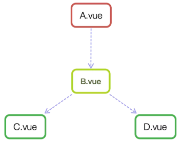

# 组件间的通信方式



### props

父组件通过 props 向下传递数据给子组件。注：组件中的数据共有三种形式：data、props、computed

子组件向父组件传值（通过事件形式） 子组件通过 events 给父组件发送消息，实际上就是子组件把自己的数据发送到父组件。

子组件：@click="changeTitle"   changeTitle() { this.$emit("titleChanged","子向父组件传值");//自定义事件 传递值“子向父组件传值” }

父组件：v-on:titleChanged="updateTitle"


### $emit/$on

通过一个空的 Vue 实例作为中央事件总线（事件中心），用它来触发事件和监听事件,巧妙而轻量地实现了任何组件间的通信，包括父子、兄弟、跨级。当我们的项目比较大时，可以选择更好的状态管理解决方案 vuex。

```js
var Event=new Vue();
    Event.$emit(事件名,数据);
    Event.$on(事件名,data => {});
```
$on 监听了自定义事件 data-a 和 data-b，因为有时不确定何时会触发事件，一般会在 mounted 或 created 钩子中来监听。

### vuex


### $parent / $children与 ref


### $attrs/$listeners


### provide/inject


[深入理解](https://www.imooc.com/article/286831?block_id=tuijian_wz)


父子通信：
父向子传递数据是通过 props，子向父是通过 events（$emit）；通过父链 / 子链也可以通信（$parent / $children）；ref 也可以访问组件实例；provide / inject API；$attrs/$listeners
兄弟通信：
Bus；Vuex
跨级通信：
Bus；Vuex；provide / inject API、$attrs/$listeners


